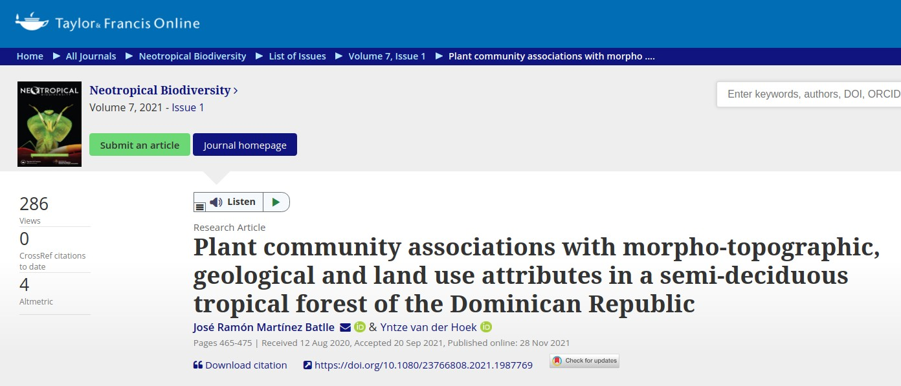
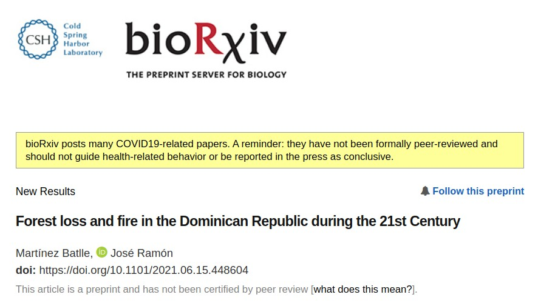
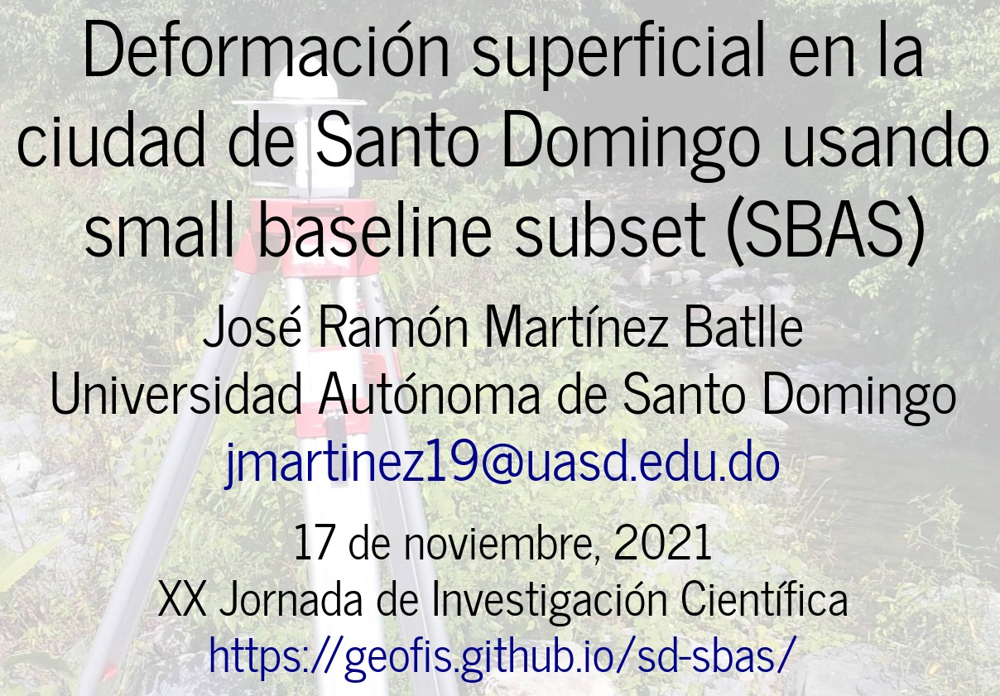
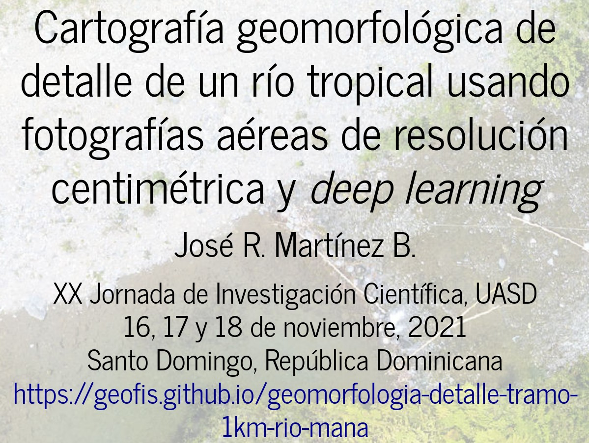
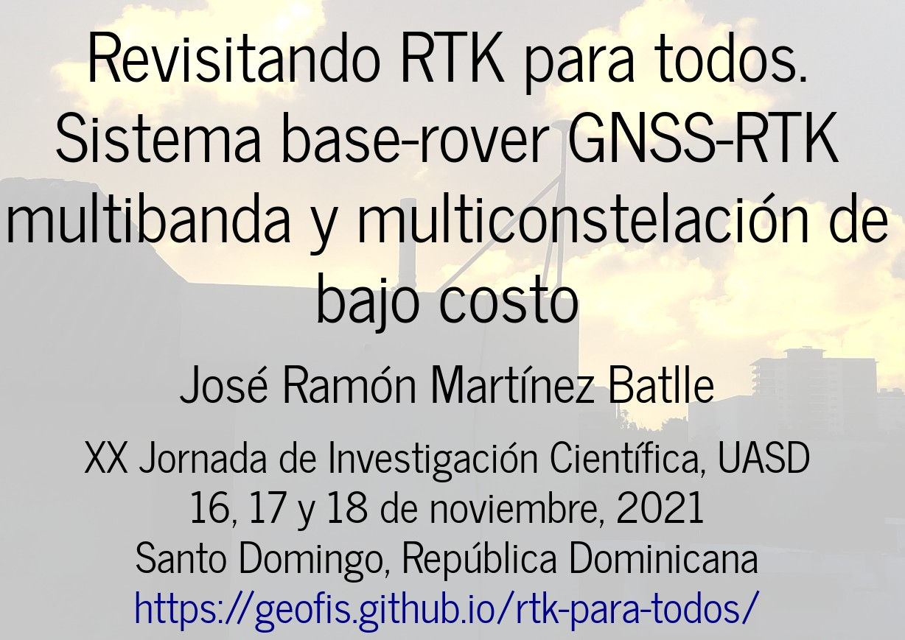
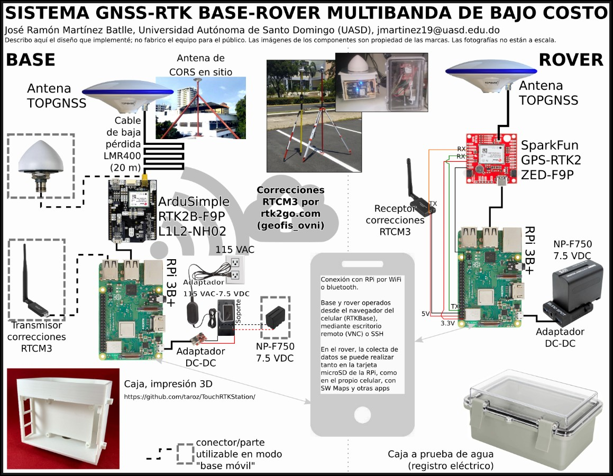
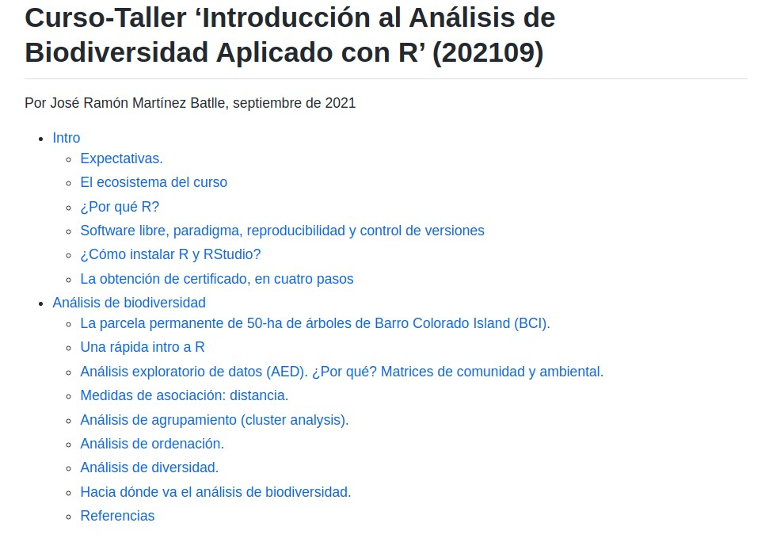
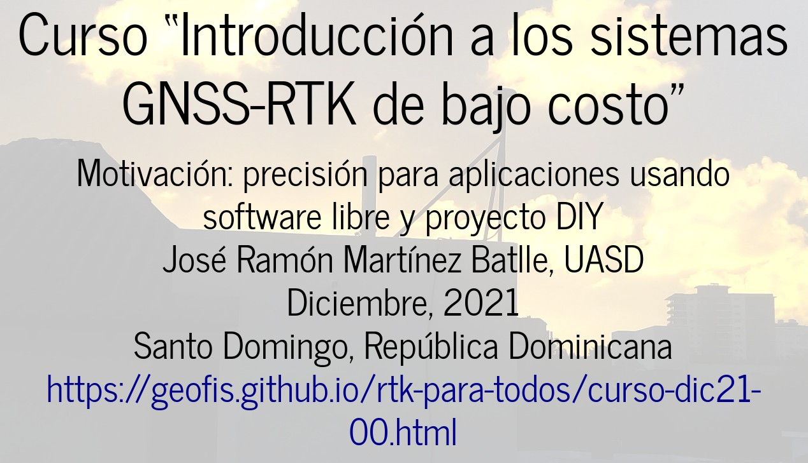

Lista de manuscritos para 2022, actualizaciones e informes
================
José Ramón Martínez Batlle   Investigador / profesor de la
Universidad Autónoma de Santo Domingo (UASD)   Última actualización:
agosto, 2022

<!-- README.md is generated from README.Rmd. Please edit that file -->

> [Saltar a informe semestre 01-2022](#informe-semestre-01-2022)

> [Saltar a informe semestre 02-2021](#informe-semestre-02-2021)

Mi meta para 2022 será (además de impartir clases): conseguir la
publicación de un manuscrito, y escribir y **enviar** otros 3
manuscritos para publicación. Por “manuscrito” entiéndase “proyecto”,
porque en términos prácticos es lo que son, pero sin la parte
administrativa. **Escribir y enviar un manuscrito** es el resultado de
un largo camino que implica diseño de muestreo, colecta de datos,
análisis, redacción, envío, revisiones, reenvío, …, hasta alcanzar un
artículo publicado. Produzco nuevo conocimiento hasta donde el
autofinanciamiento me lo permite, lo cual tiene otra ventaja: mis
estudiantes identifican que investigar es posible con los recursos que
se tienen a mano.

¿Qué me mueve?

1.  Quiero cambiar el “es un trabajo en curso” por “este es mi aporte”.
    Visualizar muchos de mis “trabajos en curso” me ayudará a
    concluirlos. No se trata de una competición, se trata de “dar a
    luz”.

2.  Quiero seguir haciendo ciencia sin proyecto, sin soporte
    administrativo, sin fondos. Lo he venido haciendo desde hace tiempo,
    y me parece que es la mejor alternativa hasta tanto la “burocracia
    se una a la ciencia”.

3.  Enviar mis trabajos preferiblemente a
    comunidades/editoriales/revistas que sigan el modelo de publicación
    en acceso abierto tipo diamante, como [*Peer Community In*
    (PCI)](https://peercommunityin.org/). Los que hemos pagado cargos
    por procesamiento de artículos (**article processing charges**, APC)
    alguna vez en nuestra carrera científica, sabemos que es una de las
    partes más oscuras del proceso de publicación. Desde hace algún
    tiempo, me he propuesto evitar esta doble tributación, y dejar de
    formar parte de la fuerza de trabajo no remunerada de las
    editoriales.

¿Qué publicaré? Lógicamente, sobre biogeografía y geomorfología, usando
software libre, con datos previamente colectados y por colectar,
siguiendo criterio de preproducibilidad. Mi lista de deseos de
manuscritos, se encuentra [más abajo](#relacion-de-manuscritos-2022).

Prefiero pensar que enviaré manuscritos, y no que publicaré artículos.
Además, tal como vengo haciendo desde hace años, no prestaré atención al
factor de impacto, ni al prestigio, ni a la insignia. Las editoriales de
lujo logran su cometido cuando las universidades usan el “prestigio”
para evaluar a su profesorado; ignoraré este asunto, así de simple.

¿Qué cosas me importarán?

1.  La satisfacción de escribir conocimiento nuevo.

2.  Producir conocimiento que quede disponible al público, especialmente
    a mis estudiantes.

3.  Seguir aprendiendo.

Por supuesto, enviaré mis manuscritos a revistas, pero previamente
publicando en servidores de *preprint*. Si las revistas quieren publicar
mis trabajos, pues bien, pero siempre habrá una copia en servidores de
*preprint*. Me satisface ver que varios de mis trabajos alojados en
servidores de *preprint* han sido leídos miles de veces.

¿Cómo lo haré? Mis estudios seguirán cumpliendo los principios de:

1.  Preproducibilidad, que significa poderlos reproducir por terceros
    con *scripts* provistos por mí como apoyo adicional.

2.  Ser realizables en contextos de bajo costo.

##  Relación de manuscritos “reservados” para 2022 (orden aleatorio)

-   [x] Fuego y pérdida de bosque en República Dominicana durante el
    siglo XXI. [¡Publicado! Ver
    aquí.](https://peercommunityjournal.org/articles/10.24072/pcjournal.157/)

-   [ ] Medición de la deformación superficial en la ciudad de Santo
    Domingo a partir de datos GNSS-RTK correlacionado con *small
    baseline subset* por interferometría SAR (InSAR-SBAS).

-   [ ] Cartografía geomorfológica de detalle de un río tropical usando
    fotografías aéreas de resolución centimétrica y deep learning.

-   [ ] Medición del tamaño superficial de gravas en una llanura de
    inundación tropical usando SfM aplicado a imágenes tomadas por drone
    y *machine learning*.

------------------------------------------------------------------------

##  De lo que me propuse en el primer semestre de 2022, ¿qué logré?

### Investigación

-   [x] ~~Fuego y pérdida de bosque en República Dominicana durante el
    siglo XXI. Remitido a **Peer Community in**, en proceso de
    publicación~~.

Este trabajo se encuentra ya ~~en la “pasarela de publicación”~~
publicado (ver
[aquí](https://peercommunityjournal.org/articles/10.24072/pcjournal.157/)).
El trabajo es bastante innovador, y se espera que inspire
investigaciones similares en el futuro. La revista es **Peer Community
Journal**, que es el órgano de difusión de **Peer Community In** (PCI).
PCI es una organización sin fines de lucro conformada por científicos de
todo el mundo, que ofrece un proceso editorial de ciencia abierta
mediante la creación de comunidades específicas de investigadores que
revisan y recomiendan preprints. Son comunidades, pero no por ello
tienen baja calidad los trabajos que se recomiendan para publicación.

-   [ ] Colecta de datos de terreno para el estudio “Medición de la
    deformación superficial en la ciudad de Santo Domingo a partir de
    datos GNSS-RTK correlacionado con *small baseline subset* por
    interferometría SAR (InSAR-SBAS)”

Esta investigación se encuentra avanzada. Continúo colectando datos en
distintos puntos de Santo Domingo (la persona que se sienta con
frecuencia por largas horas frente al Alma Mater de la UASD con un
trípode, un palo y una antena “rara”, soy yo). Dispongo de resultados
preliminares que evidencian movimiento horizontal de la ciudad,
consistente con otras observaciones y el modelo de la tectónica de
placas, pero hay datos nuevos sobre movimiento vertical que podrían ser
de interés para determinados barrios de la capital (Los Guandules es uno
de ellos), dado que presentan altas tasas de subsidencia.

### Docencia

Impartidas las asignaturas “geomorfología” y “biogeografía”. Evalué por
medio de “pequeñas” investigaciones, no por exámenes, tal como vengo
haciéndolo desde hace años.

### Particularidades

Como de costumbre, reitero algunas particularidades sobre mi forma de
hacer ciencia y docencia:

1.  No me baso en financiamiento externo, uso mi salario, armo mi propio
    equipamiento (con hardware “hazlo tú mismo”) e intento no depender
    de estructuras ni de fondos concursables.

2.  Publico todo lo que hago (código, *scripts*, manuscritos). Asimismo,
    desde hace algún tiempo, sólo envío trabajos a revistas de sociedad
    y, en ningún caso, a editoriales de lujo que exijan *article
    processing charges* (APC) o que sean de acceso restringido.

3.  Conecto los resultados de investigación con la docencia.

4.  Imparto cursos con el contenido de la producción científica.

5.  Imparto charlas sobre los temas que investigo.

------------------------------------------------------------------------

##  De lo que me propuse en 2021, ¿qué logré durante el segundo semestre?

### Investigación

-   [x] Asociaciones de comunidades de plantas con variables ambientales
    en un bosque tropical semideciduo de República Dominicana.
    Presentado en las XIX Jornada de Investigación Científica de la UASD
    (XIX JIC-UASD, 2019).
    -   [Artículo en Neotropical
        Biodiversity](https://doi.org/10.1080/23766808.2021.1987769).
    -   [Preprint en
        bioRxiv](https://www.biorxiv.org/content/10.1101/2020.08.04.235390v1.full).
    -   [Código de R reproducible del
        manuscrito](https://github.com/geofis/forest-loss-fire-reproducible).
        Incluye código usado para los análisis y cuadernos RMarkdown
        debidamente tejidos a formato PDF.
    -   [Datos fuente](https://zenodo.org/record/5681481#.Yf2KInUzb0o).
    -   [Diapositivas](https://geofis.github.io/historia-de-un-rechazo-ordenacion-comunidades-plantas-ocoa/).

-   [x] Pérdida de bosque y fuego en República Dominicana durante el
    siglo XXI. Remitido a **Peer Community in**, organización científica
    sin fines de lucro que ofrece un proceso editorial de ciencia
    abierta mediante la creación de comunidades específicas de
    investigadores que revisan y recomiendan *preprints*. **La editorial
    solicitó una “revisión menor”. Me encuentro en proceso de remitir
    revisión**. Presentado en las XX Jornada de Investigación Científica
    de la UASD (XX JIC-UASD).
    -   [Preprint remitido a
        bioRxiv](https://www.biorxiv.org/content/10.1101/2021.06.15.448604v2).
    -   [Diapositivas](https://geofis.github.io/forest-loss-fire-reproducible/#/).
    -   [Vídeo de
        presentación](https://www.youtube.com/watch?v=jcf0B_y2fuc&t=2390s).

-   [x] Medición de la deformación superficial en la ciudad de Santo
    Domingo a partir de small baseline subset (SBAS). Presentado en las
    XX Jornada de Investigación Científica de la UASD (XX JIC-UASD).
    Logré avances, pero necesita terminación durante este año.
    -   [Diapositivas](https://geofis.github.io/sd-sbas/#/).
    -   [Vídeo de
        presentación](https://www.youtube.com/watch?v=Tq1QtuSkwLE&t=5585s).

-   [x] Avances del estudio ‘Cartografía geomorfológica de detalle de un
    río tropical usando fotografías aéreas de resolución centimétrica y
    deep learning’. Logré avances, pero necesita terminación durante
    este año.
    -   [Diapositivas](https://geofis.github.io/geomorfologia-detalle-tramo-1km-rio-mana/#/).
    -   [Vídeo de
        presentación](https://www.youtube.com/watch?v=Tq1QtuSkwLE&t=3162s).

-   [x] Revisitando RTK para todos. Diseño e implementación de sistema
    base-rover GNSS-RTK multibanda y multiconstelación de bajo costo.
    Presentado en las XX Jornada de Investigación Científica de la UASD
    (XX JIC-UASD).
    -   [Diapositivas](https://geofis.github.io/rtk-para-todos/).
    -   [Vídeo de
        presentación](https://www.youtube.com/watch?v=Jzeyj1FtHTI&t=459s).

|                         |                           |
|:-----------------------:|:-------------------------:|
|  |  |

### Docencia

Desde 2018, en las asignaturas “geomorfología” y “biogeografía”, no
evalúo por exámenes, sino por medio de “pequeñas” investigaciones. Para
ello, simulo un ambiente de revista científica, de la que soy editor y
revisor a la vez; mis estudiantes escriben manuscritos para esa
“revista”. Investigar e impartir docencia es complicado, pero tiene una
“ventaja” para mis estudiantes: tienen contacto con una persona que se
está “peleando” con editores, revisores y revistas. Así, los expongo a
un “extracto” del proceso de publicación científica.

El beneficio que obtienen mis estudiantes, y así se los digo, es que la
redacción de manuscritos les prepara mejor para afrontar sus tesis de
licenciatura, y les aporta más herramientas para aumentar su capacidad
de redacción, muy útil también en el ejercicio profesional. Por otro
lado, el beneficio que obtengo es exponerme a las muy distintas formas
de organizar ideas con las que llega cada estudiante a mis materias.
Aprendo y sufro, pero como me gusta leer, también disfruto. No obstante,
reconozco que la parte de solicitar revisiones a mis estudiantes es muy
tediosa.

Para mí y para mis estudiantes, el semestre es un largo y duro camino.
Pongo herramientas informáticas en servidores (R, RStudio, GRASS GIS,
Git, GitHub, etc.) y doy soporte técnico casi en el acto (e.g. foro)
ante dudas o complicaciones. El soporte técnico atenúa (pero no elimina
del todo) las frustraciones propias de adentrarse en el “fascinante”
mundo de la programación para análisis científicos. Escribir un
manuscrito sin usar interfaz gráfica (e.g. “tejer” documentos
RMarkdown), es en sí misma una tarea desafiante. Dado que funjo como
editor/revisor, indico puntos a mejorar, por lo que una de las cosas que
más me agrada de este método de evaluación, es que veo el
perfeccionamiento de la redacción en el tiempo. Como les digo a mis
estudiantes: por más que nos guste analizar datos, un día, hay que
“sentarse” a escribir los resultados.

¿Cuál es la parte más débil de esta modalidad? No logro retener a la
mayoría hasta el final. Pido mucho, y pido desarrollar varios
intangibles complicados de alcanzar: capacidad de análisis y de
síntesis, dar el salto de “hacer un trabajito” a “producir
conocimiento”.

Durante el segundo semestre de 2021 mis estudiantes escribieron varios
manuscritos que pasaron una ronda de revisión hecha por mí. Hago una
relación a continuación de los manuscritos, incluyendo nombre de
estudiante, título de la investigación, asignatura y enlace a PDF en
GitHub.

-   Asignatura geomorfología: Isaac de la Rosa Caraballo, “Análisis
    morfométrico fluvial de la cuenca del Soco por medio de sotfware de
    código abierto”. [Enlace a
    PDF](https://github.com/geomorfologia-202102/unidad-0-asignacion-99-mi-manuscrito-isaac17dlrc/blob/master/manuscrito.pdf)

-   Asignatura biogeografía (este y los siguientes): Carolain Pérez
    Ureña, “Análisis de la familia de plantas Malvaceae en la parcela de
    50 Hectáreas de la Isla Barro Colorado, Panamá”. [Enlace a
    PDF](https://github.com/biogeografia-202102/unidad-0-asignacion-99-mi-manuscrito-carolainperez/blob/master/manuscrito.pdf)

-   Darihana Linares Laureano. “Estudio de la biodiversidad de Myrtaceae
    en la Isla de Barrio Colorado, Panamá, Desde la Ecología Numérica”.
    [Enlace a
    PDF](https://github.com/biogeografia-202102/unidad-0-asignacion-99-mi-manuscrito-DarihanaLinaresL/blob/master/manuscrito.pdf)

-   José Abreu Díaz. “Análisis de la Familia de Moraceae en una Parcela
    de 50 Hectáreas, Dentro de la Isla Barro Colorado”. [Enlace a
    PDF](https://github.com/biogeografia-202102/unidad-0-asignacion-99-mi-manuscrito-GeografosigloXXV/blob/master/manuscrito.pdf)

-   Melany Karina Ogando Matos. “Patrones de distribución, asociación y
    diversidad de la comunidad de Chrysobalanaceae utilizando técnicas
    de ecología numérica en la parcela permanente de Barro Colorado
    Island (BCI)”. [Enlace a
    PDF](https://github.com/biogeografia-202102/unidad-0-asignacion-99-mi-manuscrito-Karina-27/blob/master/manuscrito.pdf)

-   Merali Rosario. “Asociación y composición florística de la familia
    Sapotaceae en la parcela permanente de 50h, Isla Barro Colorado”.
    [Enlace a
    PDF](https://github.com/biogeografia-202102/unidad-0-asignacion-99-mi-manuscrito-merali-rosario/blob/master/manuscrito.pdf)

### Actividades de extensión

Durante el segundo semestre, también organicé dos cursos.

-   [x] Curso-Taller ‘Introducción al Análisis de Biodiversidad Aplicado
    con R’. Asociación Dominicana de Estudiantes de Biología (ADEBIO).
    -   [Repositorio de
        GitHub](https://github.com/geofis/curso-taller-analisis-biodiversidad-r-adebio-2021)

-   [x] Curso ‘Introducción a los sistemas GNSS-RTK de bajo costo con
    software libre. Precisión para aplicaciones usando software libre y
    proyecto DIY’. Hasta donde sé, este es el primer curso de GNSS-RTK
    impartido en RD usando sólo software de código abierto y libre,
    equipos de bajo costo accesibles “hazlo tú mismo” (*do it
    yourself*). También di soporte técnico a participantes para que
    hicieran sus propios proyectos DIY.
    -   [Repositorio de
        GitHub](https://github.com/geofis/rtk-para-todos/tree/gh-pages).
    -   [Vídeos de las
        sesiones](https://www.youtube.com/playlist?list=PLDcT2n8UzsCRwLvmM2AfdNjK39RzRHTmZ)

## De lo que me propuse en 2021, ¿qué NO logré durante el segundo semestre?

Me propuse escribir y enviar siete manuscritos, y esta meta superaba por
mucho lo que mi capacidad real me permitía. El repo
[manuscritos-2021](https://github.com/geofis/manuscritos-2021) contiene
la ambiciosa lista que me propuse. Relaciono a continuación lo no
logrado:

-   Manuscrito no elaborado: “Medición de la deformación superficial en
    la cuenca del río Ocoa a partir de small baseline subset (SBAS)”.

-   Manuscrito no elaborado: “Asociación con variables ambientales de
    comunidades de plantas en un bosque seco de República Dominicana”.

-   Aunque avancé bastante, no terminé el manuscrito “Cartografía
    geomorfológica de gran escala de 1 kilómetro de río tropical a
    partir de SfM e imágenes tomadas por drone”, y lo pasé para este
    año.

------------------------------------------------------------------------

## “Fondo” (2023 y más allá)

Conservo y agrando una lista de manuscritos que verán la luz algún día.
Es una especie de *bucket list* que me inspira a terminar lo que tengo
pendiente para producir nuevo conocimiento en el futuro.

-   [ ] Macroinvertebrados de agua dulce de un río tropical intervenido
    antrópicamente: asociación con microhábitat.

-   [ ] Fuego y sequía en República Dominicana durante el siglo XXI.

-   [ ] Asociación con variables ambientales de comunidades de plantas
    en un bosque seco de República Dominicana.

-   [ ] Medición de la deformación superficial en la cuenca del río Ocoa
    a partir de small baseline subset (SBAS).

-   [ ] Granulometría de gravas superficiales en la llanura de
    inundación de un río tropical: ordenación y análisis espacial.

-   [ ] Cartografía geomorfológica de la cuenca del río Ocoa a partir de
    SfM y modelos digitales de superficie.

-   [ ] Morfometría de cuencas en República Dominicana: análisis
    espacial y multivariado.

-   [ ] Mapa de cobertura arbórea de un campus universitario a partir de
    *machine learning* e imágenes de resolución espacial submétrica.

-   [ ] Ordenación restringida de comunidades de plantas a partir de
    datos de GBIF: sesgo, patrones, tendencias.

-   [ ] Medición de la deformación superficial en el deslizamiento Los
    Lazos (Azua, República Dominicana) a partir de small baseline subset
    (SBAS).

-   [ ] Estimación del porcentaje de cobertura arbórea de bosque
    semideciduo a partir de imágenes de resolución espacial métrica y
    submétrica.

-   [ ] Conteo de árboles de aguacate a partir de redes neuronales e
    imágenes ópticas de resolución espacial métrica.

-   [ ] Terrazas del río Ocoa en su zona media-alta: secuencia
    cronoestratigráfica.

-   [ ] Caracterización de la morfometría de cañones fluvio-kársticos a
    partir de SfM y modelos digitales de superficie.

-   [ ] coastr: paquete de R para crear transectos perpendiculares a la
    línea de costa.

-   [ ] Análisis espacial de la granulometría de arena de una playa
    tropical.
